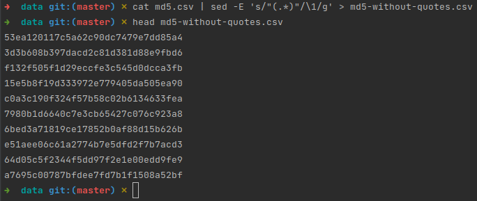
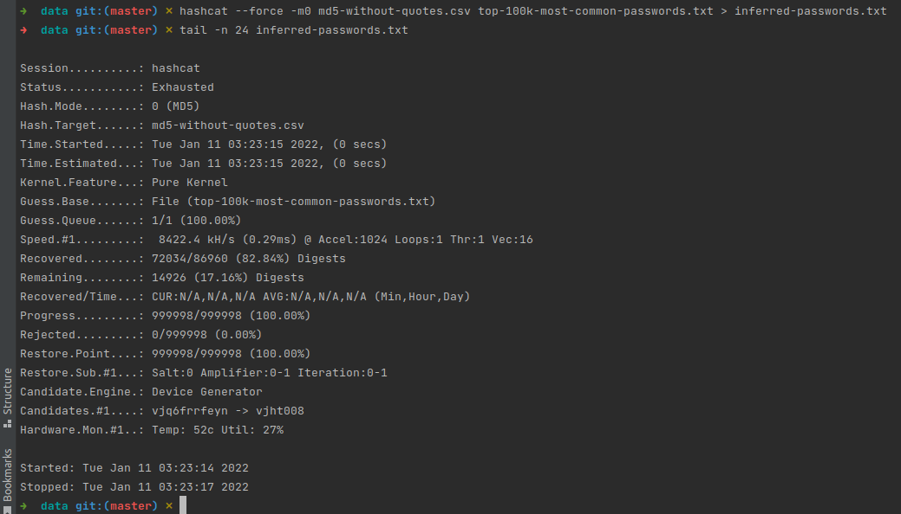
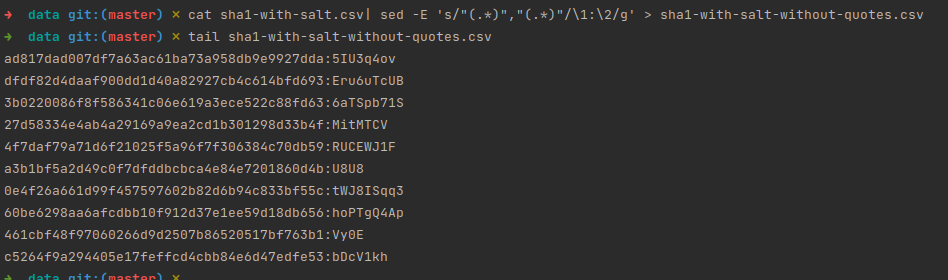
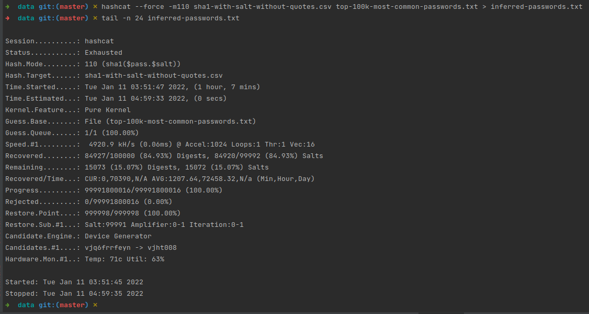

### MD5
##### Remove quotes from md5.csv:

##### Recovering MD5 passwords using dictionary ([top-100k-most-common-passwords.txt](data/top-100k-most-common-passwords.txt)):

82.84% of passwords recovered

### SHA1 with salt
##### Prepare file with hashes and salt for hashcat:

##### Recovering passwords:

